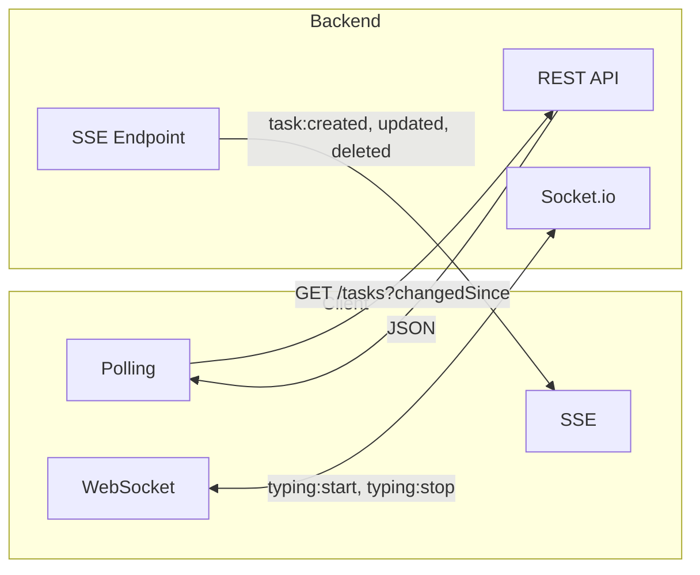

# Client Overview

> **Note:** This client was quickly "vibe coded" to demo the backend's real-time features. It does not reflect production frontend practices.

## What It Does

A task board UI (vanilla JavaScript) that demonstrates three real-time communication patterns: Polling, Server-Sent Events, and WebSocket.

## Real-Time Communication

### Polling

`polling.js` — Fetches `/api/tasks?changedSince={timestamp}` every 1 second. Pauses when the browser tab is hidden.

### Server-Sent Events

`sse.js` — Connects to `/api/events` and listens for:
- `task:created`, `task:updated`, `task:deleted`
- `comment:created`, `comment:updated`, `comment:deleted`
- `task:assigned`, `task:unassigned`

### WebSocket

`websocket.js` — Socket.io connection for real-time typing indicators. Emits `typing:start` and `typing:stop` events when users type comments.

## Using the Client

1. **Switch users** — Click the user dropdown in the header to select Alice, Bob, or Charlie
2. **Toggle real-time methods** — Click the service badges (Polling, SSE, WebSocket) in the header to enable/disable each independently
3. **Refresh** — Click the blue refresh button to manually fetch the latest tasks
4. **Create tasks** — Click "Add Task" to create new tasks
5. **Drag and drop** — Move tasks between columns to change status
6. **Comments** — Open a task to add/edit comments (typing indicators appear for other users)

## File Structure

| File | Purpose |
|------|---------|
| `app.js` | State management and event handlers |
| `api.js` | HTTP client with cookie-based auth |
| `ui.js` | DOM rendering |
| `polling.js` | Polling service |
| `sse.js` | SSE service |
| `websocket.js` | Socket.io service |
| `settings.js` | localStorage preferences |
